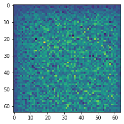
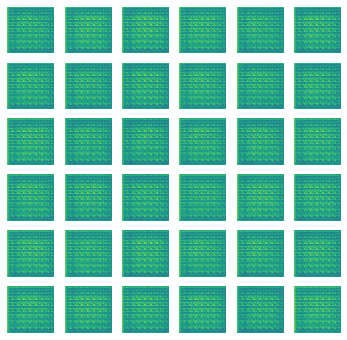
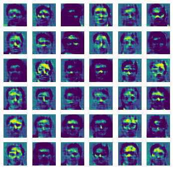
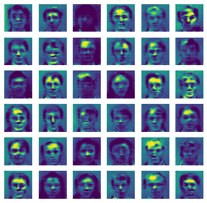
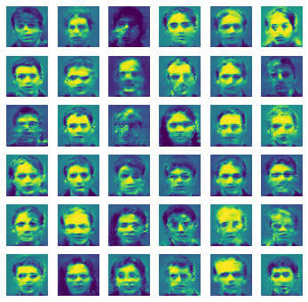
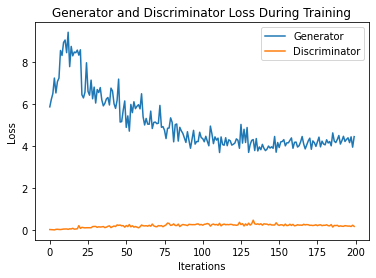

```python
import tensorflow as tf
from tensorflow.keras.layers import Conv2D,Dense,Conv2DTranspose,AveragePooling2D,BatchNormalization,LeakyReLU,Reshape,Dropout,Flatten
import sklearn
import datetime
from sklearn.datasets import load_files
import matplotlib.pyplot as plt
import numpy as np
from io import BytesIO
import pickle
from tensorflow.summary import SummaryWriter
%load_ext tensorboard
from PIL import Image  
```


```python
pickle_train = "/content/drive/My Drive/Dataset/DL-Assign 2/data.pickle"

pickle_in = open(pickle_train,'rb')
data = pickle.load(pickle_in)
```


```python
BUFFER_SIZE = 30000
BATCH_SIZE = 128

data = (data - 127.5) / 127.5
train_dataset = tf.data.Dataset.from_tensor_slices(data).shuffle(BUFFER_SIZE).batch(BATCH_SIZE)
```


```python
def generator_builder():
    model = tf.keras.Sequential()
    model.add(Dense(8*8*512,use_bias=False,input_shape=(100,)))
    model.add(BatchNormalization())
    model.add(LeakyReLU())
    model.add(Reshape((8,8,512)))
    assert model.output_shape == (None, 8, 8, 512)

    model.add(Conv2DTranspose(256,(5, 5), strides=(2, 2), padding='same', use_bias=False))
    assert model.output_shape == (None, 16, 16, 256)
    model.add(BatchNormalization())
    model.add(LeakyReLU())

    model.add(Conv2DTranspose(128, (5, 5), strides=(2, 2), padding='same', use_bias=False))
    assert model.output_shape == (None, 32, 32, 128)
    model.add(BatchNormalization())
    model.add(LeakyReLU())

    model.add(Conv2DTranspose(64, (5, 5), strides=(2, 2), padding='same', use_bias=False))
    assert model.output_shape == (None, 64, 64, 64)
    model.add(BatchNormalization())
    model.add(LeakyReLU())

    model.add(Conv2DTranspose(32, (5, 5), strides=(1, 1), padding='same', use_bias=False))
    assert model.output_shape == (None, 64, 64, 32)
    model.add(BatchNormalization())
    model.add(LeakyReLU())

    model.add(Conv2DTranspose(3, (5, 5), strides=(1, 1), padding='same', use_bias=False, activation='tanh'))
    assert model.output_shape == (None, 64, 64, 3)

    return model
```


```python
generator = generator_builder()

noise = tf.random.normal([1, 100])
generated_image = generator(noise, training=False)

plt.imshow(generated_image[0, :, :, 0])
generator.summary()
```

    Model: "sequential"
    _________________________________________________________________
    Layer (type)                 Output Shape              Param #   
    =================================================================
    dense (Dense)                (None, 32768)             3276800   
    _________________________________________________________________
    batch_normalization (BatchNo (None, 32768)             131072    
    _________________________________________________________________
    leaky_re_lu (LeakyReLU)      (None, 32768)             0         
    _________________________________________________________________
    reshape (Reshape)            (None, 8, 8, 512)         0         
    _________________________________________________________________
    conv2d_transpose (Conv2DTran (None, 16, 16, 256)       3276800   
    _________________________________________________________________
    batch_normalization_1 (Batch (None, 16, 16, 256)       1024      
    _________________________________________________________________
    leaky_re_lu_1 (LeakyReLU)    (None, 16, 16, 256)       0         
    _________________________________________________________________
    conv2d_transpose_1 (Conv2DTr (None, 32, 32, 128)       819200    
    _________________________________________________________________
    batch_normalization_2 (Batch (None, 32, 32, 128)       512       
    _________________________________________________________________
    leaky_re_lu_2 (LeakyReLU)    (None, 32, 32, 128)       0         
    _________________________________________________________________
    conv2d_transpose_2 (Conv2DTr (None, 64, 64, 64)        204800    
    _________________________________________________________________
    batch_normalization_3 (Batch (None, 64, 64, 64)        256       
    _________________________________________________________________
    leaky_re_lu_3 (LeakyReLU)    (None, 64, 64, 64)        0         
    _________________________________________________________________
    conv2d_transpose_3 (Conv2DTr (None, 64, 64, 32)        51200     
    _________________________________________________________________
    batch_normalization_4 (Batch (None, 64, 64, 32)        128       
    _________________________________________________________________
    leaky_re_lu_4 (LeakyReLU)    (None, 64, 64, 32)        0         
    _________________________________________________________________
    conv2d_transpose_4 (Conv2DTr (None, 64, 64, 3)         2400      
    =================================================================
    Total params: 7,764,192
    Trainable params: 7,697,696
    Non-trainable params: 66,496
    _________________________________________________________________





```python
def discriminator_builder():
    model = tf.keras.Sequential()
    model.add(Conv2D(64,(5,5),strides=(2,2),padding='same',name="TER",input_shape=[64,64,3]))
    model.add(BatchNormalization())
    model.add(LeakyReLU())
    model.add(Dropout(0.2))
    
    model.add(Conv2D(128,(5,5),strides=(2,2),padding='same',name="2"))
    model.add(BatchNormalization())
    model.add(LeakyReLU())
    model.add(Dropout(0.2))
    
    model.add(Conv2D(256,(5,5),strides=(2,2),padding='same',name="3"))
    model.add(BatchNormalization())
    model.add(LeakyReLU())
    model.add(Dropout(0.2))

    model.add(Conv2D(512,(5,5),strides=(2,2),padding='same',name="4"))
    model.add(BatchNormalization())
    model.add(LeakyReLU())
    model.add(Dropout(0.2))
    
    model.add(Flatten())
    model.add(Dense(1))

    return model
```


```python
discriminator = discriminator_builder()
decision = discriminator(generated_image)
print (decision)

discriminator.summary()
```

    tf.Tensor([[-0.0002206]], shape=(1, 1), dtype=float32)
    Model: "sequential_1"
    _________________________________________________________________
    Layer (type)                 Output Shape              Param #   
    =================================================================
    TER (Conv2D)                 (None, 32, 32, 64)        4864      
    _________________________________________________________________
    batch_normalization_5 (Batch (None, 32, 32, 64)        256       
    _________________________________________________________________
    leaky_re_lu_5 (LeakyReLU)    (None, 32, 32, 64)        0         
    _________________________________________________________________
    dropout (Dropout)            (None, 32, 32, 64)        0         
    _________________________________________________________________
    2 (Conv2D)                   (None, 16, 16, 128)       204928    
    _________________________________________________________________
    batch_normalization_6 (Batch (None, 16, 16, 128)       512       
    _________________________________________________________________
    leaky_re_lu_6 (LeakyReLU)    (None, 16, 16, 128)       0         
    _________________________________________________________________
    dropout_1 (Dropout)          (None, 16, 16, 128)       0         
    _________________________________________________________________
    3 (Conv2D)                   (None, 8, 8, 256)         819456    
    _________________________________________________________________
    batch_normalization_7 (Batch (None, 8, 8, 256)         1024      
    _________________________________________________________________
    leaky_re_lu_7 (LeakyReLU)    (None, 8, 8, 256)         0         
    _________________________________________________________________
    dropout_2 (Dropout)          (None, 8, 8, 256)         0         
    _________________________________________________________________
    4 (Conv2D)                   (None, 4, 4, 512)         3277312   
    _________________________________________________________________
    batch_normalization_8 (Batch (None, 4, 4, 512)         2048      
    _________________________________________________________________
    leaky_re_lu_8 (LeakyReLU)    (None, 4, 4, 512)         0         
    _________________________________________________________________
    dropout_3 (Dropout)          (None, 4, 4, 512)         0         
    _________________________________________________________________
    flatten (Flatten)            (None, 8192)              0         
    _________________________________________________________________
    dense_1 (Dense)              (None, 1)                 8193      
    =================================================================
    Total params: 4,318,593
    Trainable params: 4,316,673
    Non-trainable params: 1,920
    _________________________________________________________________


```python
cross_entropy = tf.keras.losses.BinaryCrossentropy(from_logits=True)
```


```python
def discriminator_loss(real_output, fake_output):
    real_loss = cross_entropy(tf.ones_like(real_output), real_output)
    fake_loss = cross_entropy(tf.zeros_like(fake_output), fake_output)
    total_loss = real_loss + fake_loss
    return total_loss
```


```python
def generator_loss(fake_output):
    return cross_entropy(tf.ones_like(fake_output), fake_output)
```


```python
generator_optimizer = tf.keras.optimizers.Adam(1e-4)
discriminator_optimizer = tf.keras.optimizers.Adam(1e-4)
```


```python
generator_loss_hist = tf.keras.metrics.Mean('gen_loss', dtype=tf.float32)
discriminator_loss_hist = tf.keras.metrics.Mean('disc_loss', dtype=tf.float32)
```


```python
epochs = 200
noise_dim = 100
num_examples = 36

seed = tf.random.normal([num_examples, noise_dim])
```


```python
@tf.function
def train_step(images):
    noise = tf.random.normal([BATCH_SIZE, noise_dim])

    with tf.GradientTape() as gen_tape, tf.GradientTape() as disc_tape:
      generated_images = generator(noise, training=True)

      real_output = discriminator(images, training=True)
      fake_output = discriminator(generated_images, training=True)

      gen_loss = generator_loss(fake_output)
      disc_loss = discriminator_loss(real_output, fake_output)

      generator_loss_hist(gen_loss)
      discriminator_loss_hist(disc_loss)

    gradients_of_generator = gen_tape.gradient(gen_loss, generator.trainable_variables)
    gradients_of_discriminator = disc_tape.gradient(disc_loss, discriminator.trainable_variables)

    generator_optimizer.apply_gradients(zip(gradients_of_generator, generator.trainable_variables))
    discriminator_optimizer.apply_gradients(zip(gradients_of_discriminator, discriminator.trainable_variables))

```


```python
current_time = datetime.datetime.now().strftime("%Y%m%d-%H-%M-%S")
gan_log_dir = 'logs/gradient_tape/' + current_time + '/gan'
#disc_log_dir = 'logs/gradient_tape/' + current_time + '/disc'
GAN_summary_writer = tf.summary.create_file_writer(gan_log_dir)
#disc_summary_writer = tf.summary.create_file_writer(disc_log_dir)

```


```python
listy_gen = []
listy_disc = []
def train(dataset, epochs):
    for epoch in range(epochs):
    #start = time.time()

        print(epoch)
        for image_batch in dataset:
            train_step(image_batch)
    
        listy_gen.append(generator_loss_hist.result())
        listy_disc.append(discriminator_loss_hist.result())

        if epoch % 50 == 0:
            generate_and_save_images(generator,epoch,seed)

        generator_loss_hist.reset_states()
        discriminator_loss_hist.reset_states()
```


```python
def generate_and_save_images(model, epoch, test_input):

  predictions = model(test_input, training=False)

  fig = plt.figure(figsize=(6,6))

  for i in range(predictions.shape[0]):
      plt.subplot(6, 6, i+1)
      plt.imshow(predictions[i, :, :, 0] * 127.5 + 127.5)
      plt.axis('off')

  plt.savefig(f'image_at_epoch_{epoch}.png')
  plt.show()
  plt.close('all')
  plt.clf()
```


```python
train(train_dataset, 200)
```

    0





    1
    2
    3
    4
    5
    6
    7
    8
    9
    10
    11
    12
    13
    14
    15
    16
    17
    18
    19
    20
    21
    22
    23
    24
    25
    26
    27
    28
    29
    30
    31
    32
    33
    34
    35
    36
    37
    38
    39
    40
    41
    42
    43
    44
    45
    46
    47
    48
    49
    50


    <Figure size 432x288 with 0 Axes>





    51
    52
    53
    54
    55
    56
    57
    58
    59
    60
    61
    62
    63
    64
    65
    66
    67
    68
    69
    70
    71
    72
    73
    74
    75
    76
    77
    78
    79
    80
    81
    82
    83
    84
    85
    86
    87
    88
    89
    90
    91
    92
    93
    94
    95
    96
    97
    98
    99
    100


    <Figure size 432x288 with 0 Axes>





    101
    102
    103
    104
    105
    106
    107
    108
    109
    110
    111
    112
    113
    114
    115
    116
    117
    118
    119
    120
    121
    122
    123
    124
    125
    126
    127
    128
    129
    130
    131
    132
    133
    134
    135
    136
    137
    138
    139
    140
    141
    142
    143
    144
    145
    146
    147
    148
    149
    150


    <Figure size 432x288 with 0 Axes>





    151
    152
    153
    154
    155
    156
    157
    158
    159
    160
    161
    162
    163
    164
    165
    166
    167
    168
    169
    170
    171
    172
    173
    174
    175
    176
    177
    178
    179
    180
    181
    182
    183
    184
    185
    186
    187
    188
    189
    190
    191
    192
    193
    194
    195
    196
    197
    198
    199


    <Figure size 432x288 with 0 Axes>


```python
plt.title("Generator and Discriminator Loss During Training")
plt.plot(listy_gen,label="Generator")
plt.plot(listy_disc,label="Discriminator")
plt.xlabel("Iterations")
plt.ylabel("Loss")
plt.legend()
plt.savefig('graph.png')
plt.show()
plt.close('all')
plt.clf()
```





    <Figure size 432x288 with 0 Axes>

